# How can sentiment analysis of publicly available product reviews help in predicting market trends and consumer behavior?
 - **Tools:** Apache Spark (ML for sentiment analysis), MongoDB (storage), Hive (querying datasets), HDFS (storage).
 - **Expected Outcome:** Predict market trends and consumer behavior based on sentiment analysis of product reviews.

## Pipeline Flow

1. **CSV Input → HDFS**

   * Upload all product review CSVs to HDFS (`/SentimentAnalysis/Input`).

2. **Hive Table**

   * Create `sentimentdb.reviews` as an external table pointing to HDFS CSVs.
   * Query and explore raw review data.

3. **Apache Spark ML**

   * Load reviews from Hive.
   * Preprocess text: tokenize → remove stopwords → TF features.
   * Train logistic regression to predict sentiment (positive/negative).
   * Store predictions to MongoDB and aggregate trends per brand/category.

4. **MongoDB Storage**

   * Stores detailed review sentiment predictions (`results` collection).
   * Can be queried directly or used for dashboards.

5. **Trend Analysis in Hive**

   * Aggregate metrics: `positive_percentage`, `recommend_percentage`, `total_reviews`.
   * Identify best-performing categories and brands.

6. **Visualization**

   * Connect MongoDB or Hive to Power BI / Tableau for dashboards.
   * Track market trends, sentiment, and customer recommendation patterns.

✅ **Outcome:**

* Each product review gets a sentiment prediction.
* Aggregated trends per brand/category are stored in Hive (`trend_summary`) and MongoDB (`results`).
* Dashboards can visualize market trends and customer behavior patterns.

                                          +---------------------+
                                          | Product Review CSVs |
                                          +---------------------+
                                                    |
                                                    v
                                          +---------------------+
                                          |     HDFS Storage    |
                                          |  (/Sentiment/Input) |
                                          +---------------------+
                                                    |
                                                    v
                                          +---------------------+
                                          |        Hive         |
                                          |  (reviews table)    |
                                          +---------------------+
                                                    |
                                                    v
                                          +---------------------+
                                          |   Apache Spark ML   |
                                          | (Tokenize + TF-IDF  |
                                          | + Logistic Model)   |
                                          +---------------------+
                                                    |
                                                    v
                                          +---------------------+
                                          |        MongoDB      |
                                          | (Predictions Store) |
                                          +---------------------+
                                                    |
                                                    v
                                          +---------------------+
                                          | Power BI / Tableau  |
                                          | (Market Trend Viz)  |
                                          +---------------------+

## Dataset Link
```
https://www.kaggle.com/datasets/datafiniti/consumer-reviews-of-amazon-products?resource=download
```
`Number of Rows:` 28333


| **Column Name**       | **Data Type** | **Description**                                  |
| --------------------- | ------------- | ------------------------------------------------ |
| `id`                  | STRING        | Unique identifier for the product                |
| `dateAdded`           | STRING        | Date when the product was first added            |
| `dateUpdated`         | STRING        | Date when the product details were last updated  |
| `name`                | STRING        | Name of the product                              |
| `asins`               | STRING        | Amazon Standard Identification Number(s)         |
| `brand`               | STRING        | Brand name of the product                        |
| `categories`          | STRING        | List of product categories                       |
| `primaryCategories`   | STRING        | Primary category of the product                  |
| `imageURLs`           | STRING        | URLs of product images                           |
| `keys`                | STRING        | Keywords associated with the product             |
| `manufacturer`        | STRING        | Manufacturer of the product                      |
| `manufacturerNumber`  | STRING        | Manufacturer’s part or model number              |
| `reviews_date`        | STRING        | Date of the review                               |
| `reviews_dateSeen`    | STRING        | Date when the review was seen or scraped         |
| `reviews_didPurchase` | STRING        | Indicates if the reviewer purchased the product  |
| `reviews_doRecommend` | STRING        | Indicates if the reviewer recommends the product |
| `reviews_id`          | STRING        | Unique identifier for the review                 |
| `reviews_numHelpful`  | STRING        | Number of users who found the review helpful     |
| `reviews_rating`      | STRING        | Star rating given in the review                  |
| `reviews_sourceURLs`  | STRING        | Source URL(s) of the review                      |
| `reviews_text`        | STRING        | Text content of the review                       |
| `reviews_title`       | STRING        | Title or headline of the review                  |
| `reviews_username`    | STRING        | Username of the reviewer                         |
| `sourceURLs`          | STRING        | URLs where the product information was obtained  |


## Directory Structure
```plaintext
SentimentAnalysis/
├── amazon_product_reviews.csv
├── SentimentAnalysis.scala/java
├── SentimentAnalysis.jar     # Auto Generated in further steps
├── classes/                  
└── README.md
```

## HDFS (CSV) 
### 1. Start Hadoop and Hive.

### 2. Upload product review CSVs to HDFS:
```
hdfs dfs -mkdir /SentimentAnalysis
hdfs dfs -mkdir /SentimentAnalysis/Input
```

```
hdfs dfs -put /home/talentum/Desktop/SentimentAnalysis/amazon_product_reviews.csv /SentimentAnalysis/Input
```

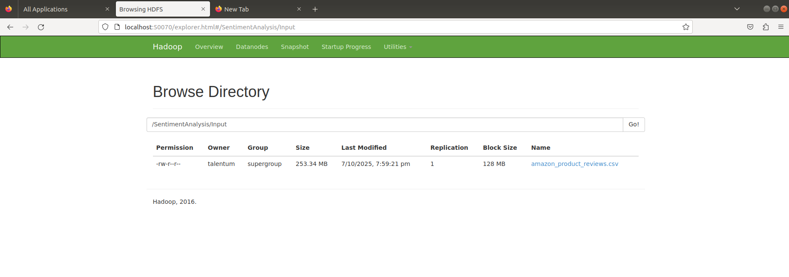


## HIVE (SentimentDB.Reviews)
### 1. Get into Hive:
```
hive
```

### 2. Create sentimentdb.reviews as an external table pointing to HDFS CSVs:
```
CREATE DATABASE sentimentdb;
USE sentimentdb;
```

```
DROP TABLE IF EXISTS sentimentdb.reviews;
```

```
CREATE EXTERNAL TABLE sentimentdb.reviews (
  id STRING,
  dateAdded STRING,
  dateUpdated STRING,
  name STRING,
  asins STRING,
  brand STRING,
  categories STRING,
  primaryCategories STRING,
  imageURLs STRING,
  keys STRING,
  manufacturer STRING,
  manufacturerNumber STRING,
  reviews_date STRING,
  reviews_dateSeen STRING,
  reviews_didPurchase STRING,
  reviews_doRecommend STRING,
  reviews_id STRING,
  reviews_numHelpful STRING,
  reviews_rating STRING,
  reviews_sourceURLs STRING,
  reviews_text STRING,
  reviews_title STRING,
  reviews_username STRING,
  sourceURLs STRING
)
ROW FORMAT SERDE 'org.apache.hadoop.hive.serde2.OpenCSVSerde'
WITH SERDEPROPERTIES (
  "separatorChar" = ",",
  "quoteChar" = "\"",
  "escapeChar" = "\\"
)
STORED AS TEXTFILE
LOCATION '/SentimentAnalysis/Input'
TBLPROPERTIES("skip.header.line.count"="1");
```

### 3. Query and explore raw review data:
```
SELECT name, brand, reviews_rating, reviews_text 
FROM sentimentdb.reviews 
LIMIT 10;
```
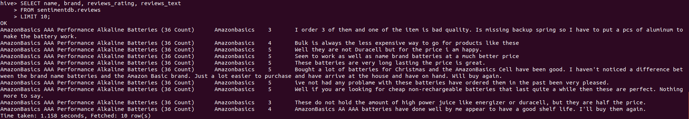


## DOCKER
### 1. Install Docker:
```
sudo apt install docker.io -y
```

### 2. Give Permission:
```
sudo usermod -aG docker $USER && newgrp docker
```
### 3. Pull and Run MongoDB:
```
docker pull mongo:4.4
```
```
docker run -d \
  --name mongodb \
  -p 27017:27017 \
  -v ~/mongodb/data:/data/db \
  mongo:4.4
```
 


## SPARK (Sentiment + Trend Analysis)

You can either use SentimentAnalysis.scala or SentimentAnalysis.java. 

### 1. Check Spark Path:
```
echo $SPARK_HOME
```

### 2. Install Scala if using SentimentAnalysis.scala:
```
sudo apt install scala
```

### 3. Create SentimentAnalysis.scala or SentimentAnalysis.java and paste code from respective code files in the repo.


### 4. Make classes directory:
```
mkdir -p classes
```

### 5. Compile Spark Job (For Scala):
```
scalac -classpath "$(hadoop classpath):/home/talentum/spark/jars/*" -d classes SentimentAnalysis.scala
```

### 5. Compile Spark Job (For Java):
```
javac -cp "$(hadoop classpath):/home/talentum/spark/jars/*" -d classes SentimentAnalysis.java
```

### 6. Create JAR
```
jar -cvf SentimentAnalysis.jar -C classes/ .
```

### 7. Run Spark Job:
```
spark-submit \
  --class SentimentAnalysis \
  --master local[*] \
  --packages org.mongodb.spark:mongo-spark-connector_2.11:2.4.3 \
  SentimentAnalysis.jar
```
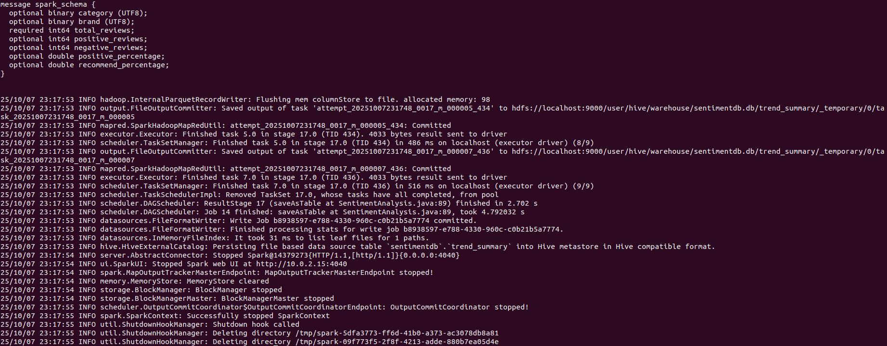


## Analyze Market Trends (Hive)

### 1. Describe Trend Table:
```
desc trend_summary;
```
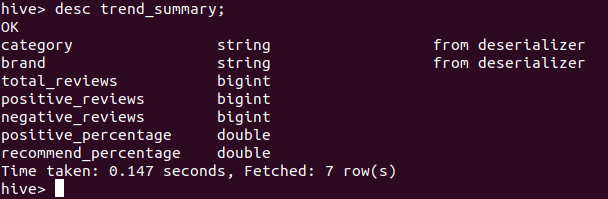

 - Aggregate metrics: positive_percentage, recommend_percentage, total_reviews. 

### 2. View Sentiment Summary:

```
SELECT * FROM sentimentdb.trend_summary LIMIT 10;
```
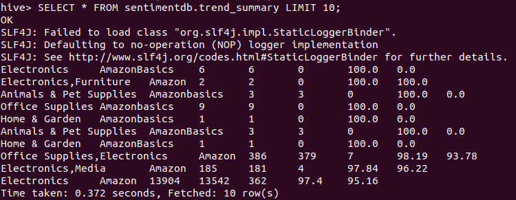

### 3. Identify Best Categories:
```
SELECT category, AVG(positive_percentage) AS avg_positive
FROM sentimentdb.trend_summary
GROUP BY category
ORDER BY avg_positive DESC;
```
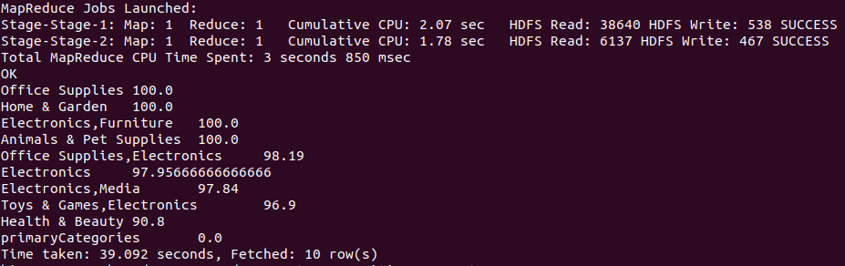

### 4. Predict Consumer Behavior:
```
SELECT brand, recommend_percentage, positive_percentage
FROM sentimentdb.trend_summary
ORDER BY recommend_percentage DESC;
```
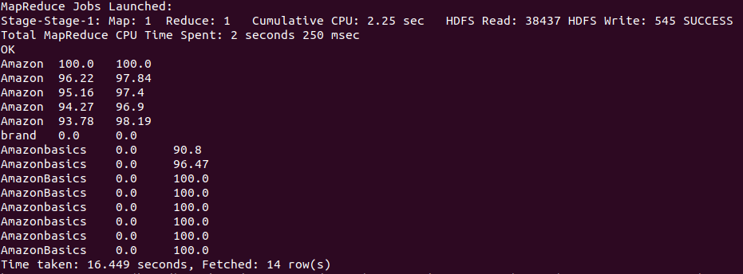

## Explore in MongoDB (Storage for dashboard/trend visualization)
### 1. Connect to mongo running in container:
```
docker exec -it mongodb mongo
```
```
use sentimentdb
```
### 2. Check Top 5 predictions stored for dashboards:
```
db.results.find().limit(5).pretty()
```
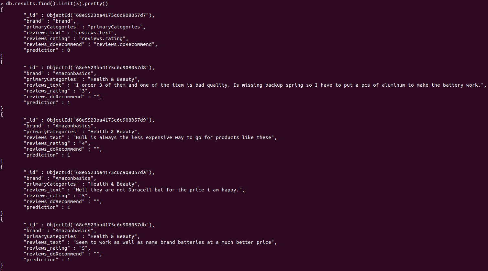

### 3. Get number of rows:
```
db.results.count()
```
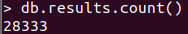

```
db.trend_summary.count()
```

### 4. Check Top 5 Reviews_Rating:
```
db.results.find().sort({ reviews_rating: -1 }).limit(5).pretty()
```
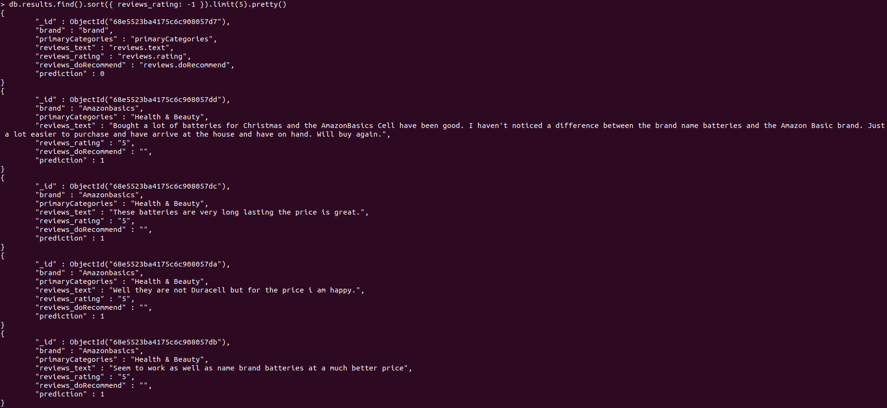

### 5. Check Bottom 5 Reviews_Rating:
```
db.results.find().sort({ reviews_rating: 1 }).limit(5).pretty()
```
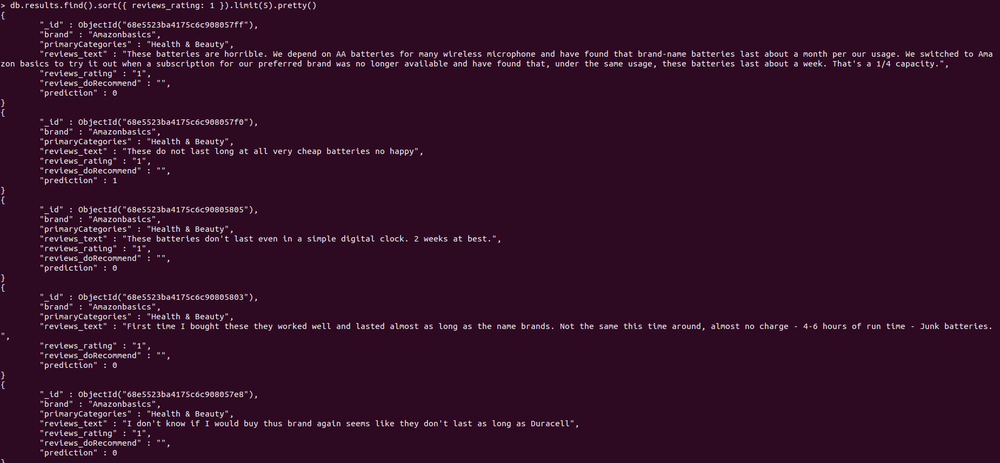

### 6. Export Results and Trend Summary:
```
docker exec -it mongodb mongoexport \
  --db sentimentdb \
  --collection results \
  --type=csv \
  --out /tmp/results.csv \
  --fields brand,primaryCategories,reviews_rating,prediction,reviews_doRecommend
```
```
docker exec -it mongodb mongoexport \
  --db sentimentdb \
  --collection trend_summary \
  --type=csv \
  --out /tmp/trend_summary.csv \
  --fields category,brand,total_reviews,positive_reviews,negative_reviews,positive_percentage,recommend_percentage
```

```
docker cp mongodb:/tmp/results.csv ~/Desktop/SentimentAnalysis/results.csv
docker cp mongodb:/tmp/trend_summary.csv ~/Desktop/SentimentAnalysis/trend_summary.csv
```

## Visualization

 - Connect MongoDB or Hive to Power BI / Tableau.

 - Track market trends, sentiment, and customer recommendation patterns.

## License
This project is licensed under the **MIT License** – see the [LICENSE](./LICENSE) file for details.

## Author

 - Abhishek Rajput
 - Arnav Jain
 - Aayusha Bhatia
